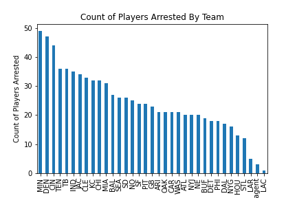
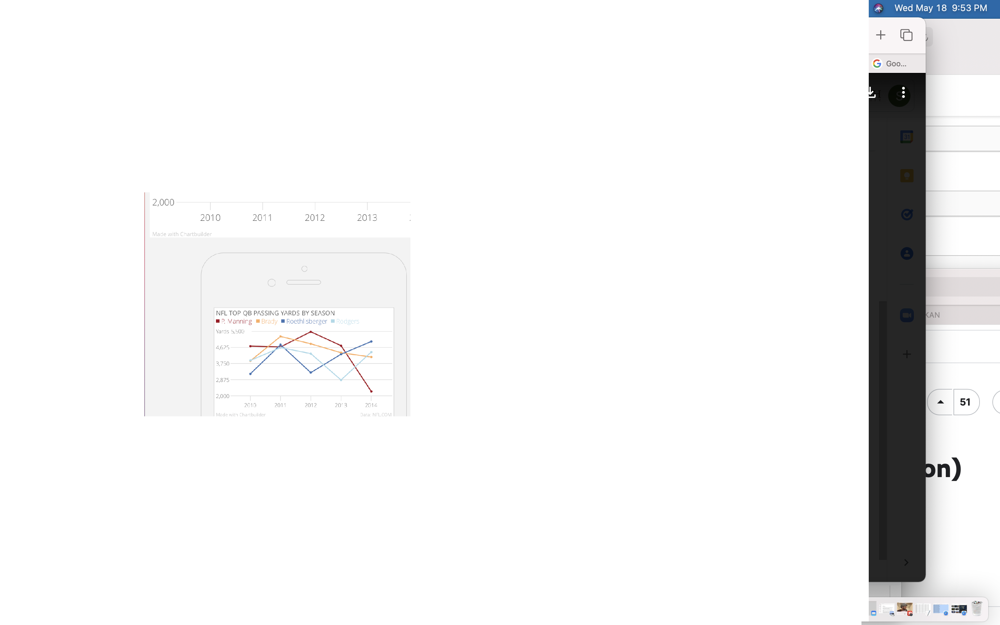
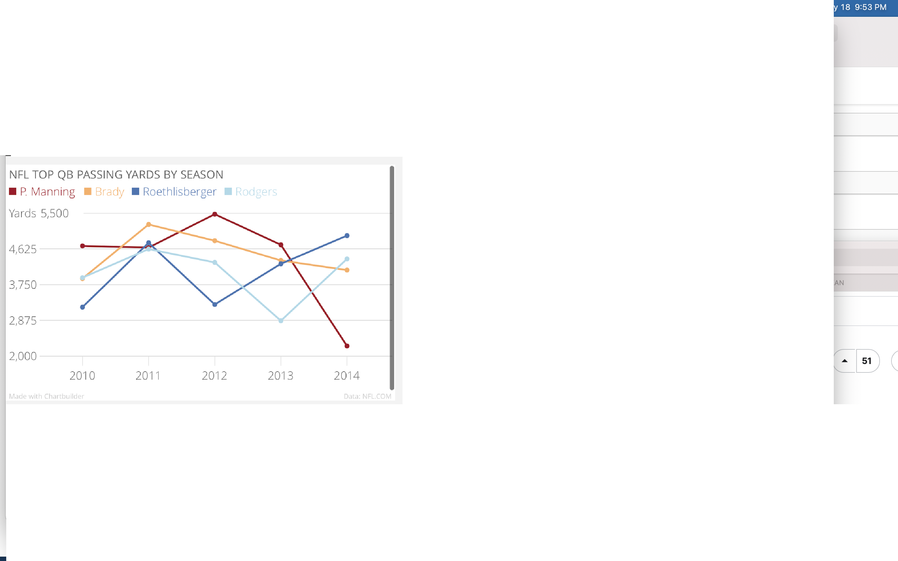

## Welcome to My Portfolio


# Bar Chart Assignment 
## [Dataset Used](https://www.kaggle.com/datasets/patrickmurphy/nfl-arrests?resource=download)
## [Link to Code for Chart Visualization](https://www.kaggle.com/stevenkattouf/notebook1fd28a46ec)


# Canva Infographic 
<div style="position: relative; width: 100%; height: 0; padding-top: 250.0000%;
 padding-bottom: 48px; box-shadow: 0 2px 8px 0 rgba(63,69,81,0.16); margin-top: 1.6em; margin-bottom: 0.9em; overflow: hidden;
 border-radius: 8px; will-change: transform;">
  <iframe loading="lazy" style="position: absolute; width: 100%; height: 100%; top: 0; left: 0; border: none; padding: 0;margin: 0;"
    src="https:&#x2F;&#x2F;www.canva.com&#x2F;design&#x2F;DAFAiEZTvJI&#x2F;view?embed" allowfullscreen="allowfullscreen" allow="fullscreen">
  </iframe>
</div>
<a href="https:&#x2F;&#x2F;www.canva.com&#x2F;design&#x2F;DAFAiEZTvJI&#x2F;view?utm_content=DAFAiEZTvJI&amp;utm_campaign=designshare&amp;utm_medium=embeds&amp;utm_source=link" target="_blank" rel="noopener">Infographic</a> by stevenkattouf

# Timeline Assignment
<iframe src='https://cdn.knightlab.com/libs/timeline3/latest/embed/index.html?source=1UBzkD5wF7iHWrda98jc1tKDTleIcoAbWAhkebw2TUsw&font=Default&lang=en&initial_zoom=2&height=650' width='100%' height='650' webkitallowfullscreen mozallowfullscreen allowfullscreen frameborder='0'></iframe>

[My LinkedIn](https://www.linkedin.com/in/steven-kattouf/) 


<!--  -->


# Google My Map Assignment 
<iframe src="https://www.google.com/maps/d/embed?mid=1-mp_Hc652xhvs_aEKSE4MgXHvvSvI-B3&ehbc=2E312F" width="640" height="480"></iframe>
# Line Chart 

 
 


```
